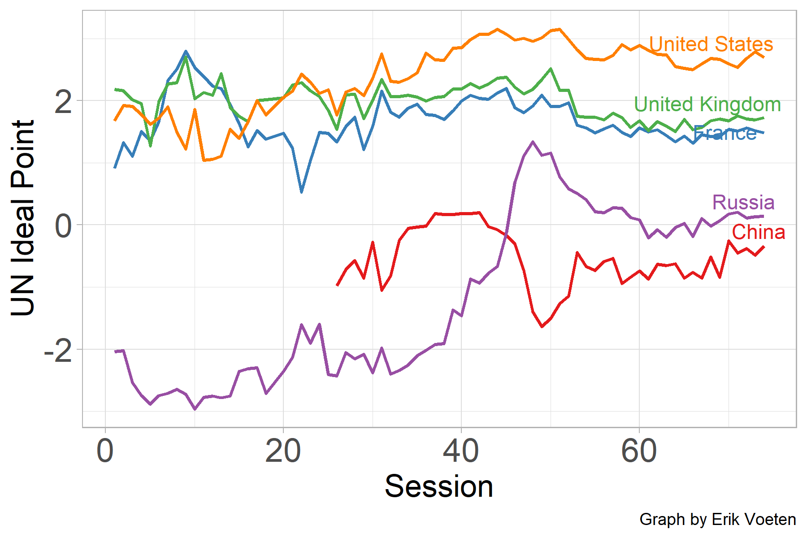
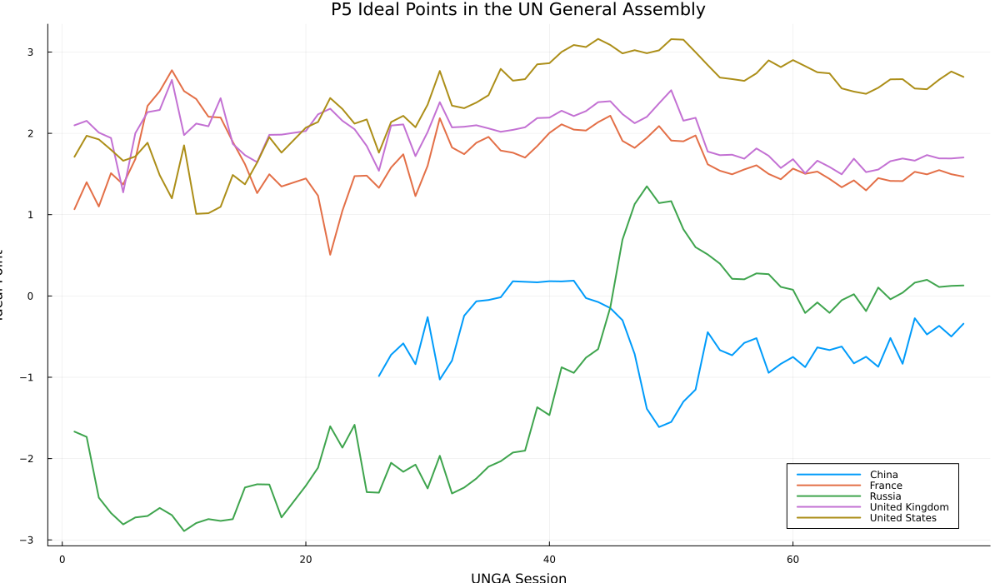
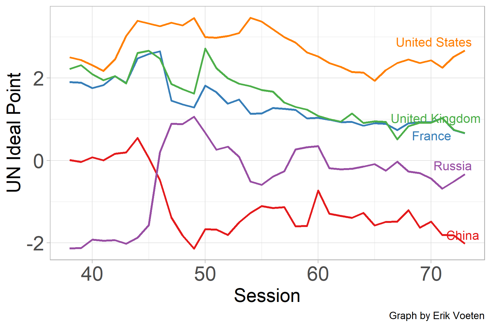
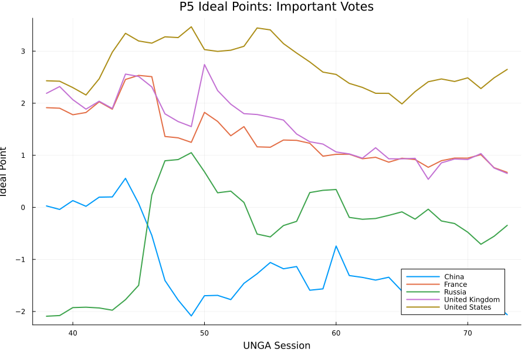

# Replicating UN Voting Ideal Points in Julia

Replication of:

Bailey, Strezhnev, and Voeten (2017),  
*Estimating Dynamic State Preferences from United Nations Voting Data*.

# Author

Valeria Farinola  
Collegio Carlo Alberto  
valeria.farinola@carloalberto.org


# Original Paper and Replication Package

Original R/Rcpp replication package:

<https://github.com/evoeten/United-Nations-General-Assembly-Votes-and-Ideal-Points>

Julia replication package developed for this project:

<https://github.com/valeriafarinola/UNIdealPointsJulia>

# High Level Description of Computational Problem

The original paper estimates dynamic country ideal points from United Nations General Assembly voting data using a Bayesian latent variable model estimated via Markov Chain Monte Carlo (MCMC).

Each country-session receives a latent ideal point parameter representing the country's position in the international political space. Votes are modeled using latent utilities, vote-specific discrimination parameters, and threshold parameters.

The computational challenge consists of reproducing the full Gibbs / Metropolis-Hastings estimation procedure in Julia while preserving the structure and behavior of the original R/Rcpp implementation.

# Replication Goals

The project has four main goals:

1. Replicate the original Bayesian MCMC estimator in Julia.
2. Reproduce country-session ideal point estimates.
3. Replicate the P5 ideal point figures from the original paper.
4. Compute dyadic ideological distances between countries.

# Julia Implementation

The Julia implementation includes:

- theta update;
- dynamic lagged theta prior;
- gamma threshold Metropolis-Hastings update;
- latent Z update;
- beta update;
- MCMC loop with burn-in and thinning;
- posterior storage and averaging;
- ideal point export.

The implementation supports both:

- the All-votes dataset;
- the Important-votes dataset.

# Replication Package Architecture

The repository was refactored into a unified replication package organized around a single master replication interface:

```julia
UNIdealPointsJulia.run_replication(; dataset, test)
```

The function supports:

- multiple datasets:
  - `dataset = :all`
  - `dataset = :important`

- multiple execution modes:
  - `test = true`
    - lightweight smoke test;
  - `test = false`
    - full Bayesian MCMC replication.

The full estimation logic is implemented in:

```text
src/replication.jl
```

while the `scripts/` directory contains lightweight wrapper scripts calling the main replication API.

# Repository Structure

```text
UNIdealPointsJulia/
│
├── src/
├── scripts/
├── data/
├── output/
├── figures/
├── notes/
├── report.qmd
├── README.md
└── Project.toml
```

# Computational Requirements

The project requires:

- Julia;
- package environment activation via `Pkg.instantiate()`;
- intermediate processed data files already included in the repository under the `data/` directory.

The intermediate data were generated from the original R/Rcpp replication package and are distributed together with this Julia replication package.

The full Bayesian MCMC replication is computationally intensive because the estimator performs a large number of iterative Gibbs / Metropolis-Hastings updates.

The full replication runs use:

- K = 20000 MCMC iterations;
- Burn = 4000;
- Thin = 50.

As a consequence, full estimation runs can require substantial execution time depending on hardware configuration.

For this reason, the repository also provides a lightweight smoke test designed to quickly verify:

- package portability;
- dependency configuration;
- correct execution of the full Bayesian sampling pipeline.

The smoke test executes the same estimation workflow with a substantially reduced number of MCMC iterations and is recommended before launching full replication runs.


# Replication Workflow

## Package Initialization

From the repository root:

```bash
julia --project=.
```

Then:

```julia
using Pkg
Pkg.instantiate()

using UNIdealPointsJulia

UNIdealPointsJulia.run()
```

# Smoke Test

A lightweight smoke test can be executed with:

```julia
using UNIdealPointsJulia

UNIdealPointsJulia.run_replication(
    dataset = :all,
    test = true
)
```

The smoke test runs the complete Bayesian sampling pipeline with a substantially reduced number of iterations.

Its purpose is to verify:

- repository portability;
- dependency configuration;
- sampler execution;
- reproducibility of the replication workflow.

# Full Replication

## Important-votes dataset

```julia
using UNIdealPointsJulia

UNIdealPointsJulia.run_replication(
    dataset = :important,
    test = false
)
```

## All-votes dataset

```julia
using UNIdealPointsJulia

UNIdealPointsJulia.run_replication(
    dataset = :all,
    test = false
)
```

# Figure Generation

After running the corresponding full replication, figures can be generated from the repository root.

## Important-votes figure

```bash
julia --project=. scripts/plot_p5_important.jl
```

## All-votes figure

```bash
julia --project=. scripts/plot_p5.jl
```

The plotting scripts require the corresponding full MCMC output files:

```text
output/ThetaEst_full.csv
output/ThetaEst_full_all.csv
```

# Main Replication Outputs

Main outputs generated by the package include:

```text
output/ThetaEst_full.csv
output/ThetaEst_full_all.csv
output/dyadic_distances_full_all.csv
```

# Replicated P5 Figures

## All-votes dataset

### Original replication output

{width=70%}

### Julia replication

{width=70%}

The Julia replication reproduces the main substantive dynamics of the original replication output, including the relative positioning of the United States, USSR/Russia, China, the United Kingdom, and France across UNGA sessions.

# Important-votes dataset

## Original replication output

{width=70%}

## Julia replication

{width=70%}

The Julia replication based on the Important-votes subset reproduces the broad structure of the original replication output while reflecting differences due to MCMC sampling variation and implementation details.

# Dyadic Ideological Distances

Dyadic ideological distances are computed as a post-estimation transformation:

```text
distance(i,j) = |theta_i - theta_j|
```

The dyadic distance output is stored in:

```text
output/dyadic_distances_full_all.csv
```

# Testing and Reproducibility

The repository includes:

- package unit tests;
- repository-relative paths using `@__DIR__`;
- lightweight smoke-test replication runs;
- full replication workflows for both datasets.

Package tests can be executed with:

```julia
using Pkg
Pkg.test()
```

# Conclusion

The Julia implementation successfully reproduces the main computational steps of the original R/Rcpp estimator and replicates the main substantive dynamics of the original paper.

The final repository structure follows a replication-package design centered around a reusable master replication interface and lightweight execution wrappers.